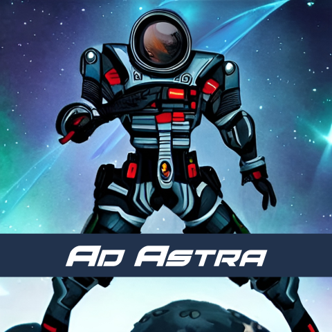
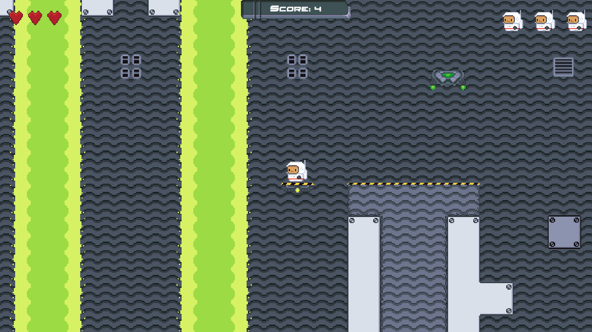
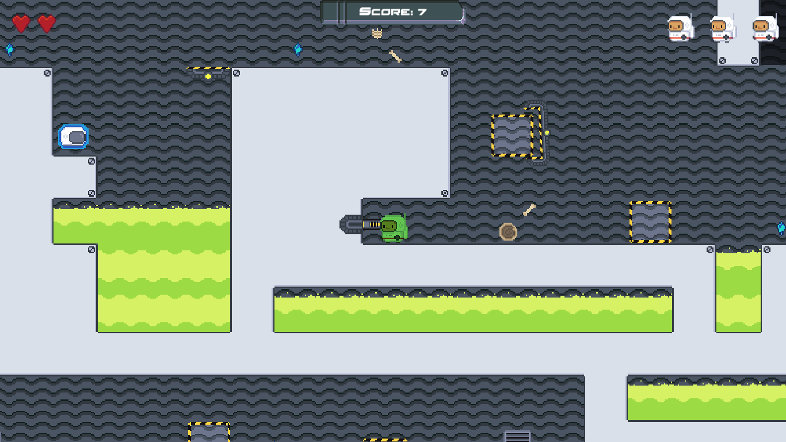
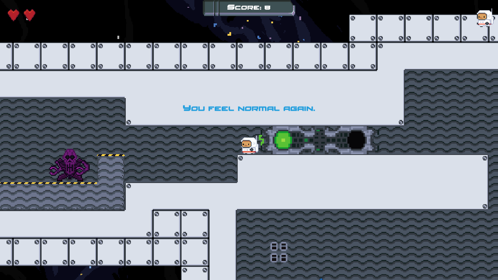
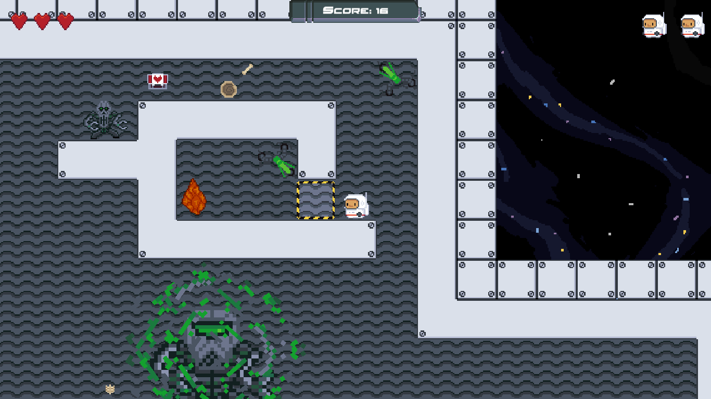

# **Ad Astra**

"Ad Astra" is a 2D platformer with a short storyline and some puzzle-like mechanics. You can play it [here](https://wgrodzicki.itch.io/ad-astra).

## **Technologies used**

The game was made in the Unity engine using C# scripting.

## **Features**

#### Backstory

In a far future humanity is forced to look for other planets suitable for life. A mission was sent to explore the galaxy and develop a map of such human-friendly places. However, the contact with the crew was lost. You and your team were chosen to find them and recover the galactic map. You finally locate the ship but when approaching it you are attacked by hostile aliens. The only survivor is you.

#### Levels

The game consists of 3 different levels. Each one is preceded by a "Star Wars-like" introduction about the progress of the story and your main goal. Every level offers a unique challenge, requiring not only agility, but also some logical thinking and puzzle-solving skills.

#### Interactivity

To make the gameplay more interesting I included interactive environment elements that you can (and should) use to your advantage, such as movable boxes, switches or destroyable platforms. I also added a looting system to enemies that drop useful pick-ups in a random fashion, depending on the type and strength of the enemy.

#### Puzzle mechanics

I designed and implemented a set of mechanics that strip the main character of his core abilities and force you to think outside the box. You have to find a way out of a high gravity chamber by manipulating the environment and appropriately timing your actions, without relying on combat or usual movement.

#### Boss fight

At the end of the last level you will have to defeat the final boss. But this encounter is not an obvious one - I implemented a system that requires you to gradually weaken the enemy before you can face him in direct combat. The final part of the game also involves a scripted event that keeps you engaged until the last seconds of the gameplay.

## **How to play?**

Start a new game to progress through all the levels or choose the specific level you want. To move around use left/right arrows. Use spacebar to jump and ctrl to perform special actions.

## **Main challenges**

When designing and implementing the project I stumbled upon several challenges:

- _OOP_. In this project I decided to take advantage of some OOP-specific techniques. I used inheritance to save codespace and change the functionality of methods in derived classes. However, it took me a while to find out how to properly apply access modifiers and override methods.
- _Displaying in-game text_. I needed a system to display in-game messages, informing the player about specific actions to perform, save points or unique events. To do that I had to make use of appropriate triggers, time-managing coroutines and checks to make sure the text was displayed once on each level or in a desired order.
- _Handling player input_. Implementing interactive environment elements (switches, movable boxes) required me to handle user input within a specific timeframe, not too short (to avoid excessive speed of events) and not too long (to avoid a lag).
- _High gravity zone_. One of the most time-consuming features of the game was the implementation of the high gravity zone, within which the player cannot jump (and, therefore, cannot fight) and is slowed down. I had to connect the enter and exit points, making them communicate with one another to enable smooth transition to and from the zone from any part of the level.
- _Transporting platforms_. Within the high gravity zone I created a system of transporting platforms that carry movable boxes spawned from vertical shafts. The player has to manipulate the platforms by pressing interactive switches, which make the boxes fall down to be used as platforms to avoid obstacles. It took me a substantial amount of time to design the system in a way that made the switches control the platforms, while spawning the boxes according to the availability of the associated platform and managing to rotation of the platform when dropping the box.
- _Final scripted event_. At the end of the last level I included a final scripted event that forces the player to run in order to avoid asteroids that destroy the spaceship. To make this sequence work smoothly I came up with an idea of an invisible spawner that would follow player on the X axis, dropping asteroids in a slightly random manner to create an impression of a constant "asteroid rain" on the screen.

## **Credits**

Created by Wojciech Grodzicki.

- Initial project template by the [Michigan State University](https://www.coursera.org/learn/game-design-and-development-2)
- Menu panels & buttons​ by Buch via [OpenGameArt](https://opengameart.org/content/sci-fi-user-interface-elements)
- Menu background​ by [Deep-Fold](https://deep-fold.itch.io/space-background-generator)
- Font​ by [Dan Zadorozny](http://www.iconian.com/)
- Explosion effect​ "Explosions" by helpcomputer via [OpenGameArt](https://opengameart.org/content/explosions-2?fbclid=IwAR0ja-GMWP5eNCLaMWP-7UVHwN5tIh7F7v-1GVzW5Zyfx-PSTt6p0eKg250) (CC BY 3.0)
- Walking enemy sound effect​ by FreeGiver via [Pixabay](https://pixabay.com/sound-effects/dragon-monstruo-criatura-gritando-rugido-14263/)
- Flying enemy sound effect​ by JCI21 via [Pixabay](https://pixabay.com/sound-effects/spaceship-ambient-sfx-164114/)
- Boss sound effect​ by [Pixabay](https://pixabay.com/sound-effects/dragon-hurt-47161/)
- Laser sound effect​ by [Pixabay](https://pixabay.com/sound-effects/electrocute-6247/)
- Acid sound effect​ by [Pixabay](https://pixabay.com/sound-effects/underwater-loop-amb-6182/)
- Sluice sound effect​ by [Pixabay](https://pixabay.com/sound-effects/stone-push-37412/)
- Switch sound effect​ by [Pixabay](https://pixabay.com/sound-effects/toy-button-105724/)
- Handwheel sound effect​ by EdR via [Pixabay](https://pixabay.com/sound-effects/electric-fan-motor-blades-removed-13169/)
- Explosion sound effect​ by [Pixabay](https://pixabay.com/sound-effects/medium-explosion-40472/)
- Cover & icon created using AI from [OpenArt](https://openart.ai/)

The game was made as the final project for the Michigan State University's course "Game Design and Development 2".